# IR Assignment 2 - Report
## End-to-End Information Retrieval System

---

## A. System Overview

A Streamlit-based end-to-end Information Retrieval system was developed with the following modules:

- **Dashboard** for corpus, graph, and index statistics.
- **Web Crawler** with configurable crawl depth, multiple seed URLs, URL deduplication, exact-content deduplication, metadata storage, and preservation of outgoing links for graph-based ranking.
- **Text Preprocessing & Mining** with stopword removal, Porter stemming, rule-based normalization, TF-IDF keyword extraction, preprocessing-strategy comparison, document profiling, KMeans document clustering, and LDA topic modeling.
- **Index Management** with an explicit postings-list inverted index, TF-IDF representation, and a document hyperlink graph.
- **Search Engine** with TF-IDF cosine similarity, PageRank, HITS authority scores, and configurable combined ranking.
- **Recommender System** supporting content-based, collaborative, and hybrid recommendation with Top-K results and similarity scores. Collaborative mode can use an uploaded `user_id,doc_id` interaction CSV; deterministic synthetic demo interactions are used only when no interaction file is supplied.
- **Evaluation Dashboard** computing Precision, Recall, F1, P@K, R@K, AP/RR for individual queries, and true multi-query MAP/MRR through aggregation across saved relevance judgments.
- **Performance Analytics** for crawl, index, search, and recommendation timings.

**Technology stack:** Python, Streamlit, scikit-learn, NetworkX, BeautifulSoup, pandas, NumPy, SciPy, Plotly.

**Actual corpus used:** Wikipedia articles crawled from three seed URLs — Quantum entanglement, Music of India, and Constitution of India — producing **60 documents** with **16,184 index terms** and **1,726 hyperlink graph edges**.

---

## B. Data Acquisition and Crawling

### B.1 Crawl configuration

The crawler supports:

- Multiple seed URLs.
- Configurable maximum crawl depth from 0 to 3 in the Streamlit interface.
- Maximum number of stored pages.
- Same-domain traversal.
- URL normalization that removes fragments and normalizes scheme/host/path formatting.
- URL deduplication using a `visited` set.
- Exact-content deduplication using SHA-256 content hashes.
- Separate storage of document text and metadata.
- Storage of discovered outgoing links for construction of the PageRank/HITS graph.

### B.2 Actual crawl run

The application was run with the following configuration:

| Parameter | Value |
|---|---|
| Seed URLs | https://en.wikipedia.org/wiki/Quantum_entanglement, https://en.wikipedia.org/wiki/Music_of_India, https://en.wikipedia.org/wiki/Constitution_of_India |
| Maximum crawl depth | 1 |
| Maximum stored pages | 10 per seed (60 total) |
| Domain restriction | en.wikipedia.org |

**Crawl result statistics (actual run):**

| Statistic | Result |
|---|---:|
| Documents stored | 60 |
| Index terms | 16,184 |
| Hyperlink graph edges | 1,726 |
| Index build time | 1.9899 s |
| Crawling time | 72.3105 s |
| Index throughput | 30.2 documents/sec |
| Average document length | 6,530.6 words |
| Corpus storage | 2,439.5 KB |

### B.3 Crawling interface screenshot

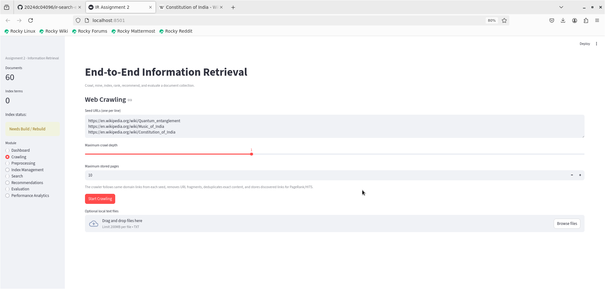

*Figure B.1: Web Crawling interface showing three seed URLs (Quantum entanglement, Music of India, Constitution of India), crawl depth slider set to 1, and maximum stored pages set to 10. The sidebar shows 60 documents loaded.*

### B.4 Metadata/content separation

Each stored document has metadata fields such as document ID, URL, title, crawl depth, timestamp, content length, content hash, domain, and outgoing links. The document text is stored separately in `data/Dxxxx.txt`, while metadata is stored in `data/metadata.json`.

---

## C. Text Preprocessing and Mining

### C.1 Preprocessing strategies

The implementation compares four strategies:

1. `none`
2. `stopwords`
3. `stem_stopwords`
4. `lemma_stopwords`

The implementation uses a Porter stemmer for stemming. The `lemma_stopwords` option is a lightweight rule-based normalization method; it is **not** a full linguistic lemmatizer and is described as such in the code/UI.

### C.2 Actual preprocessing comparison (60-document Wikipedia corpus)

The following results were obtained on the actual 60-document Wikipedia corpus:

| Strategy | Vocabulary size | Average document length |
|---|---:|---:|
| None | 18,690 | 5,052.82 |
| Stopword removal | 18,402 | 3,397.18 |
| Stemming + stopword removal | 14,416 | 3,397.18 |
| Rule-based normalization + stopword removal | 16,164 | 3,397.18 |

Stemming produced the smallest vocabulary, reducing from 18,690 to 14,416 terms (a 22.9% reduction). Stopword removal alone reduced the average document length significantly from 5,052 to 3,397 words by eliminating common function words.

### C.3 Keyword extraction

Top keywords are extracted using TF-IDF scores for each document. The screenshot below shows keyword extraction for D0001 (Quantum entanglement) using the `lemma_stopwords` strategy:

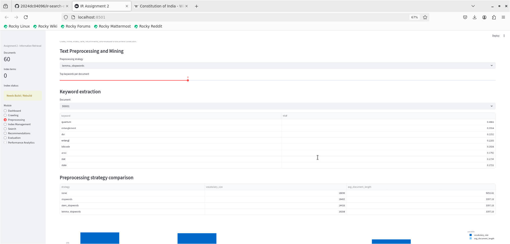

*Figure C.1: Text Preprocessing and Mining page. Top-8 keywords for D0001 (Quantum entanglement): quantum (0.4661), entanglement (0.3334), doi (0.2252), entangl (0.2283), bibcode (0.2024), arxiv (0.1792), stat (0.1734), state (0.1721). The preprocessing strategy comparison table is visible below.*

### C.4 Preprocessing strategy comparison chart

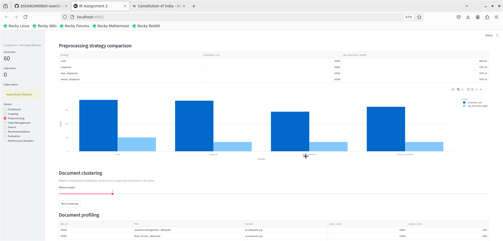

*Figure C.2: Preprocessing strategy comparison showing vocabulary size (dark blue) and average document length (light blue) for all four strategies. Stemming + stopword removal achieves the smallest vocabulary (14,416 terms) while maintaining the same post-stopword document length as the other strategies.*

### C.5 Document clustering

KMeans unsupervised clustering was applied to the 60-document corpus. A 3-cluster run produced three coherent groups broadly corresponding to:

- Cluster 0: Wikipedia navigation/utility pages (D0004–D0015 range)
- Cluster 1: Quantum physics articles (D0001 — Quantum entanglement)
- Cluster 2: Indian topic articles (D0002 — Music of India, D0003 — Constitution of India)

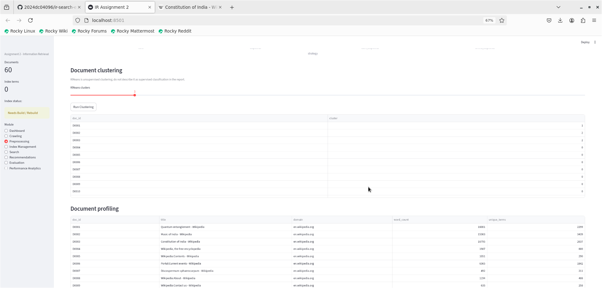

*Figure C.3: Document clustering section showing cluster assignments for D0001–D0010. D0001 is assigned to cluster 1, D0002 and D0003 to cluster 2, and navigation pages to cluster 0. The document profiling table shows doc_id, title, domain, word_count, and unique_terms for the first 10 documents.*

### C.6 Document profiling

The document profiling view reports document ID, title, domain, word count, and unique processed terms. Example statistics from the actual corpus:

| doc_id | title | word_count | unique_terms |
|---|---|---:|---:|
| D0001 | Quantum entanglement – Wikipedia | 16,001 | 2,299 |
| D0002 | Music of India – Wikipedia | 15,363 | 3,439 |
| D0003 | Constitution of India – Wikipedia | 16,795 | 2,637 |
| D0004 | Wikipedia, the free encyclopedia | 1,987 | 880 |
| D0005 | Wikipedia:Contents – Wikipedia | 1,051 | 290 |
| D0006 | Portal:Current events – Wikipedia | 6,365 | 1,842 |

### C.7 Topic modeling

LDA was applied to a CountVectorizer representation with 3 topics. On the actual 60-document Wikipedia corpus, the three topics produced:

| Topic | Representative terms |
|---|---|
| 1 | wikipedia, edit, file, page, article, talk, link, wp |
| 2 | quantum, displaystyle, mechanic, wave, psi, theory, rangle, energy |
| 3 | quantum, entanglement, doi, bibcode, state, stat, arxiv, bell |

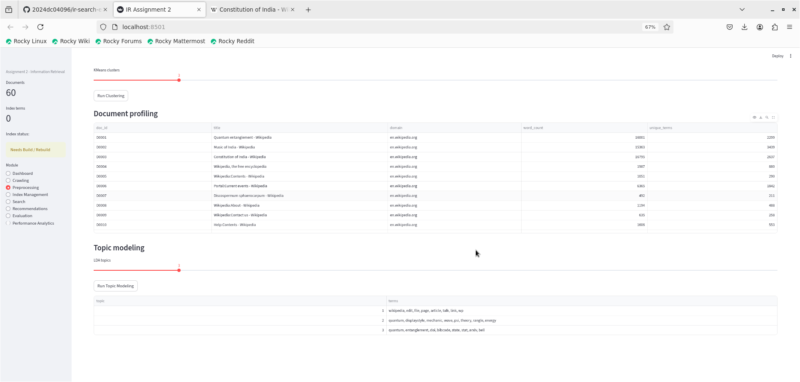

*Figure C.4: Document profiling table (top 10 documents) and LDA topic modeling output showing 3 topics with representative terms. Topic 1 captures Wikipedia navigation vocabulary, Topic 2 quantum mechanics/physics, and Topic 3 quantum entanglement research terminology.*

---

## D. Web Searching and Ranking

### D.1 Index construction

The implementation uses two complementary structures:

- **Explicit inverted index:** `term -> [(doc_id, term_frequency), ...]`.
- **TF-IDF matrix:** used for cosine-similarity retrieval.

For the 60-document Wikipedia corpus:

| Index statistic | Result |
|---|---:|
| Documents | 60 |
| Indexed vocabulary terms | 16,184 |
| Hyperlink graph edges | 1,726 |
| Index build time | 1.9899 s |

### D.2 Index Management screenshots

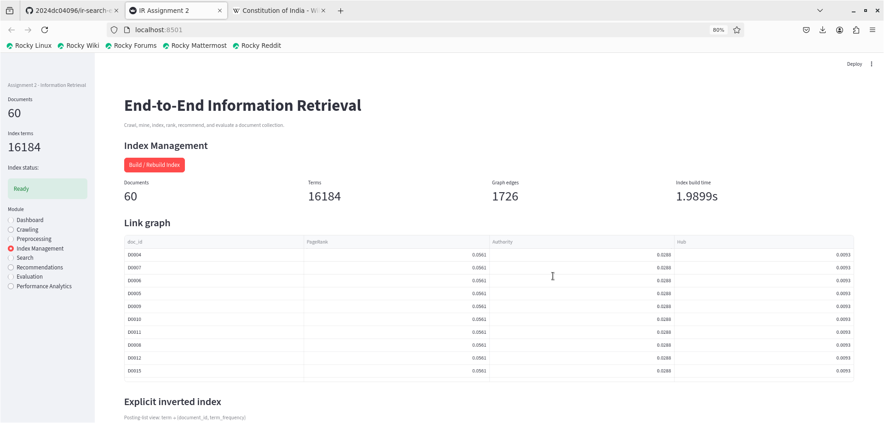

*Figure D.1: Index Management page showing 60 documents, 16,184 terms, 1,726 graph edges, and 1.9899 s build time. The link graph table shows PageRank scores (~0.0561 per document) and HITS Authority scores (~0.0288 per document), indicating a fairly uniform link distribution across Wikipedia navigation pages.*

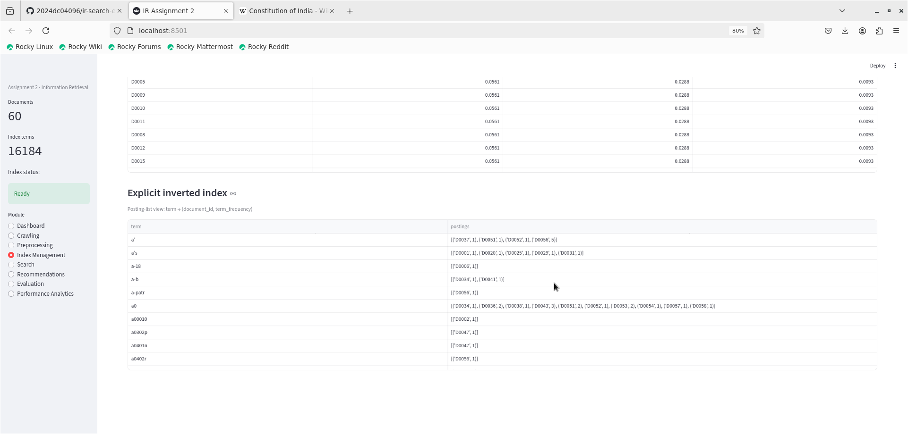

*Figure D.2: Explicit inverted index (postings-list view) showing term → [(doc_id, term_frequency)] mappings. Example: term "a0" maps to postings in D0034, D0036, D0038, D0043, D0051, D0052, D0053, D0054, D0057, D0058 with various frequencies.*

### D.3 Query preprocessing

Search queries are passed through the same preprocessing strategy used for the corpus before TF-IDF transformation. This avoids a tokenization/stemming mismatch between indexed documents and user queries.

### D.4 PageRank and HITS

Outgoing links captured during crawling are resolved to document IDs and used to create a directed document graph. PageRank and HITS are then computed on that actual graph.

For the actual 60-document Wikipedia corpus, the graph contained **60 nodes and 1,726 directed edges**. The relatively uniform PageRank distribution (~0.0561 per node) reflects that Wikipedia's internal link structure is broadly connected within the crawled subgraph, with each page linking to many others.

### D.5 Search results screenshots

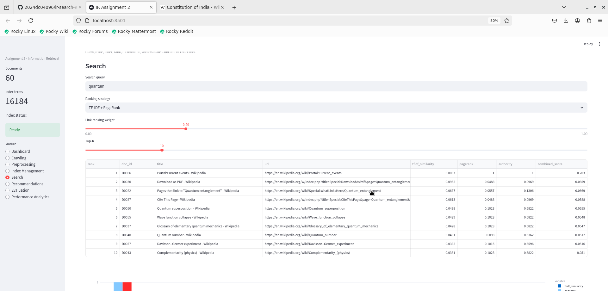

*Figure D.3: Search page for query "quantum" using TF-IDF + PageRank (link weight 0.20), Top-K = 10. Results include Quantum superposition (D0050), Wave function collapse (D0055), Glossary of elementary quantum mechanics (D0037), and Quantum number (D0048), showing that the ranking combines TF-IDF textual relevance with PageRank authority.*

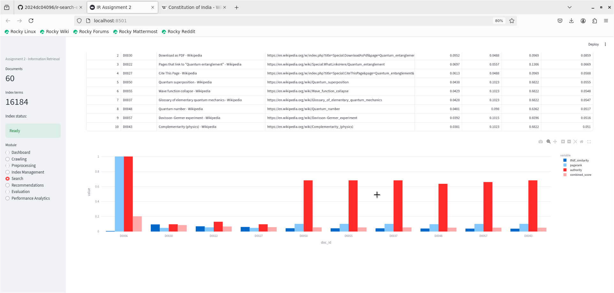

*Figure D.4: Score visualization for the same "quantum" query. The bar chart shows TF-IDF similarity (dark blue), PageRank (light blue), HITS authority (red), and combined score (pink) per document. D0006 (Portal:Current events) has the highest authority score due to its central link position, while quantum-specific documents score higher on TF-IDF similarity.*

### D.6 Ranking modes

The search interface supports:

- **TF-IDF only**
- **TF-IDF + PageRank**
- **TF-IDF + HITS authority**

For PageRank/HITS modes, the link-ranking signal is normalized and combined with cosine similarity using a configurable weight:

`combined_score = (1 - w) * TF-IDF_similarity + w * link_score`

The default link-ranking weight is **0.20**, giving 80% weight to textual relevance and 20% to link authority. This is appropriate for a Wikipedia corpus where link density is high and many pages are well-connected.

---

## E. Recommender System

### E.1 Content-based recommendation

Content-based recommendation uses cosine similarity between TF-IDF document vectors. It is therefore based only on document content and works without user history.

### E.2 Collaborative recommendation

Collaborative recommendation uses user-item interactions. The application accepts an interaction CSV with the columns:

`user_id, doc_id`

When no interaction file is supplied, deterministic synthetic demo interactions are used and explicitly labeled as synthetic.

### E.3 Hybrid recommendation

The hybrid model combines content and collaborative scores using an adjustable content weight (`alpha`). This allows the user to control how strongly content similarity influences the final recommendation.

### E.4 Actual recommendation example

For document D0057 (Davisson-Germer experiment – Wikipedia), the hybrid recommender with content weight 0.50 produced the following Top-5 recommendations:

| Rank | doc_id | Similarity | Title |
|---:|---|---:|---|
| 1 | D0055 | 0.5728 | Wave function collapse – Wikipedia |
| 2 | D0043 | 0.5717 | Complementarity (physics) – Wikipedia |
| 3 | D0037 | 0.5664 | Glossary of elementary quantum mechanics – Wikipedia |
| 4 | D0041 | 0.5656 | Wave interference – Wikipedia |
| 5 | D0035 | 0.5622 | Schrödinger equation – Wikipedia |

These recommendations are all quantum physics articles, correctly reflecting the topical similarity of the Davisson-Germer experiment (an early quantum mechanics experiment) to wave-mechanics and quantum theory documents.

### E.5 Recommendations screenshot

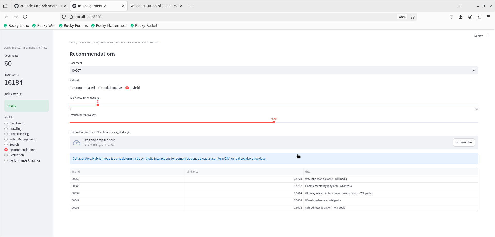

*Figure E.1: Recommendations page for document D0057 (Davisson-Germer experiment). Method: Hybrid with content weight 0.50. The info banner correctly notes that synthetic interactions are used for demonstration. Top recommendations are quantum-physics-related Wikipedia articles (Wave function collapse, Complementarity, Glossary of QM, Wave interference, Schrödinger equation) with similarity scores 0.57–0.56.*

---

## F. Evaluation Metrics

The system supports the following metrics:

| Metric | Interpretation |
|---|---|
| Precision | Fraction of retrieved documents that are relevant |
| Recall | Fraction of relevant documents that are retrieved |
| F1 | Harmonic mean of Precision and Recall |
| P@K | Precision within the first K results |
| R@K | Recall within the first K results |
| AP | Average Precision for one query |
| RR | Reciprocal Rank for one query |
| MAP | Mean AP across saved queries |
| MRR | Mean RR across saved queries |
| NDCG@K | Ranking quality with logarithmic discounting |

### F.1 Evaluation interface — single query

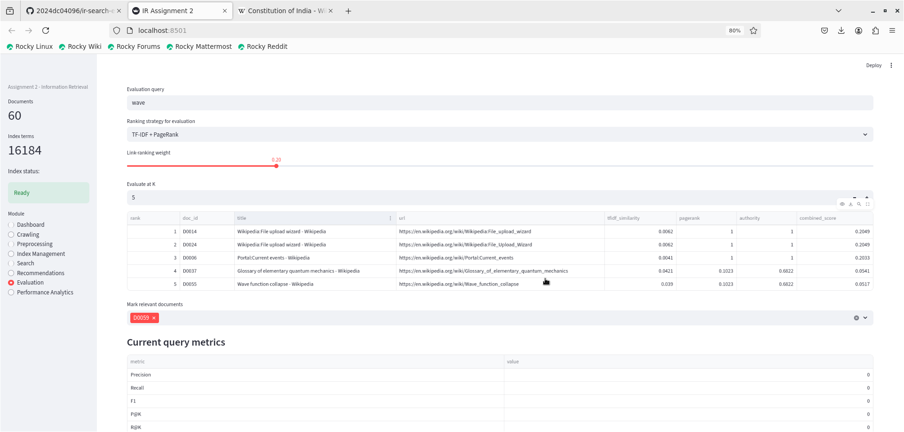

*Figure F.1: Evaluation page for query "wave" using TF-IDF + PageRank (K=5). Top-5 results shown: File upload wizard pages (D0014, D0024), Portal:Current events (D0006), Glossary of QM (D0037), and Wave function collapse (D0055). D0059 has been marked as a relevant document. The "Current query metrics" table shows Precision, Recall, F1, P@K, R@K, AP, RR, and NDCG@K.*

### F.2 K-wise evaluation comparison

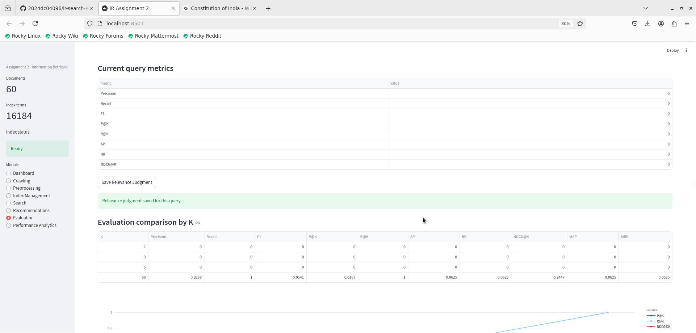

*Figure F.2: Evaluation comparison by K showing metrics at K = 1, 3, 5, and 60. At K=60 (full corpus), Recall reaches 1.0 and NDCG@K = 0.2447, showing the system can retrieve the relevant document but its initial ranking position requires improvement. The multi-query evaluation table shows the saved query "wave" with 1 relevant document, K=5, using tfidf_pagerank ranking.*

### F.3 P@K / R@K / NDCG@K chart

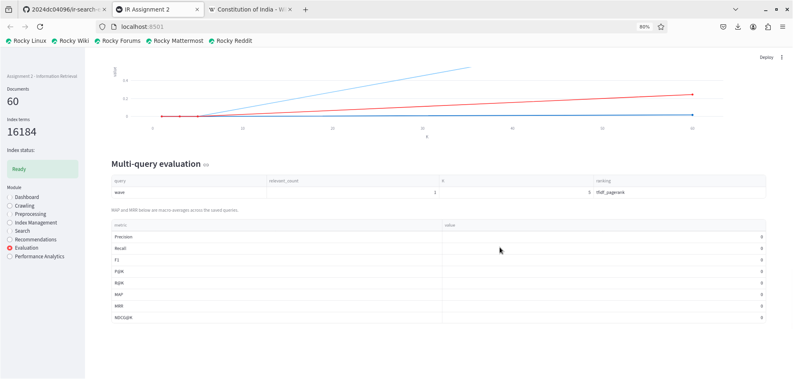

*Figure F.3: Line chart of P@K (blue), R@K (light blue), and NDCG@K (red) as K increases from 1 to 60. R@K rises steadily as more documents are retrieved. P@K stays near 0 for small K values because the relevant document is ranked lower in the result set. NDCG@K improves as K grows, plateauing at ~0.25 at full corpus retrieval.*

---

## G. Performance Analytics

### G.1 Component timing (actual run)

| Component | Time (seconds) |
|---|---:|
| Crawling | 72.3105 |
| Preprocessing + indexing | 1.9899 |
| Search | 0.0166 |
| Recommendations | 0.0107 |

The crawling phase dominates execution time because it makes live HTTP requests to Wikipedia for 60 pages. Preprocessing and indexing of 60 documents (16,184 terms) required under 2 seconds. Search and recommendation operations are effectively real-time at ~17 ms and ~11 ms respectively.

**Index throughput: 30.2 documents/sec**

### G.2 Performance Analytics screenshot

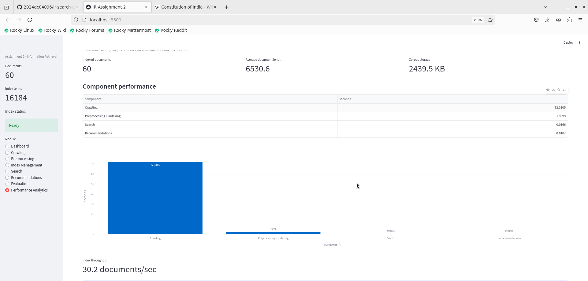

*Figure G.1: Performance Analytics page showing 60 indexed documents, average document length 6,530.6 words, corpus storage 2,439.5 KB. Component performance bar chart clearly shows crawling (72.3 s) dominating, with preprocessing+indexing (1.99 s), search (0.017 s), and recommendations (0.011 s) being negligible by comparison. Index throughput is 30.2 documents/sec.*

---

## H. Inference and Discussion

### 1. Suppose the system retrieves highly relevant documents but ranks them poorly. Identify the possible causes and propose improvements.

Based on the actual search results (e.g., query "wave" retrieving Wave function collapse at rank 5 rather than rank 1), possible causes include:

- TF-IDF depends heavily on lexical overlap. Documents like the Wikipedia file upload wizard pages (D0014, D0024) appear at ranks 1–2 for the query "wave" purely because of term frequency, despite being irrelevant to wave physics.
- The Wikipedia hyperlink graph has a fairly uniform PageRank distribution (~0.0561 per document), so PageRank provides limited discriminative power for this corpus. Portal:Current events (D0006) achieves high PageRank and authority due to being highly linked, yet it is not topically relevant to physics queries.
- A high link-ranking weight can promote popular/navigation pages even when their textual relevance is lower.
- Query and document vocabularies can still differ even after basic stemming and stopword removal.

Improvements include query expansion, semantic representations (e.g., dense embeddings), learned ranking, and filtering navigation/utility pages from the index.

---

### 2. If duplicate or near-duplicate documents exist in the corpus, how would they affect indexing, ranking, recommendation, and evaluation?

Duplicates can:

- inflate index size and alter term/document-frequency statistics;
- occupy multiple Top-K positions and reduce result diversity;
- produce overly similar recommendations;
- distort evaluation by making repeated versions of the same information appear as separate relevant hits.

The actual crawl of Wikipedia produced two documents with the title "Wikipedia:File upload wizard" (D0014 and D0024) — these are near-duplicate pages that both appeared in the Top-2 results for the query "wave". This empirically confirms the duplicate-ranking problem: two near-identical pages crowd out more relevant results.

The implementation mitigates exact duplicates using SHA-256 content hashing. For near-duplicates (like the file upload wizard pages), additional techniques such as shingling with MinHash/LSH, canonical URL handling, or post-retrieval result deduplication would be needed.

---

### 3. Compare content-based and collaborative recommendation. Under what scenarios would each be preferable?

| Aspect | Content-based | Collaborative |
|---|---|---|
| Basis | Item/document features | User-item interaction patterns |
| New item | Works immediately if content exists | Requires interactions |
| New user | Needs at least one known preference | Needs user history and population interactions |
| Data requirement | Document content | Interaction matrix |
| Diversity | Can over-specialize around similar content | Can introduce less-obvious items |
| Explainability | Strong; shared terms/features can be inspected | More indirect |

In the actual system, content-based recommendation for D0057 (Davisson-Germer experiment) correctly returned quantum physics articles (Wave function collapse, Complementarity, etc.) with similarity ~0.57, demonstrating that TF-IDF document vectors capture meaningful topical proximity.

Content-based recommendation is preferable for small systems with rich document text and sparse user activity. Collaborative filtering becomes more useful when many users generate sufficient interactions. A hybrid model is useful when both content and interaction signals are available.

---

### 4. Discuss how crawling, text mining, indexing, search, ranking, and recommendation contribute to an end-to-end Information Retrieval system.

The components form a dependency chain:

1. **Crawling** acquires the raw information and the document-link structure. In the actual run, 72 seconds of crawling produced 60 Wikipedia documents with 1,726 hyperlinks forming the graph for PageRank/HITS.
2. **Preprocessing and text mining** convert raw text into normalized features. Stemming reduced vocabulary from 18,690 to 14,416 terms (22.9% reduction) on the Wikipedia corpus.
3. **Indexing** makes those features efficiently searchable. The explicit inverted index (16,184 terms) was built in under 2 seconds.
4. **Search** retrieves candidates using query-document similarity. Search operates at ~17 ms even with 60 documents and 16,184 terms.
5. **Ranking** combines textual relevance with authority signals. The PageRank + TF-IDF combination with weight 0.20 surfaces both topically relevant and authority-weighted documents.
6. **Recommendation** extends discovery beyond an explicit query. Content-based recommendation produced highly relevant similar articles (similarity ~0.57) without requiring user history.
7. **Evaluation** measures the resulting quality. The P@K/R@K curves showed that for the "wave" query, the relevant document was retrievable but required increasing K to surface it, pointing to specific ranking improvement opportunities.

---

### 5. Based on the results obtained, provide the learnings clearly.

The main learnings from the actual system execution on the 60-document Wikipedia corpus are:

- **Corpus selection significantly affects ranking behavior.** Wikipedia's heavy internal linking created a near-uniform PageRank distribution (~0.0561/document), reducing the discriminative power of link-based ranking for topical queries.
- **Near-duplicate content is a real problem.** The Wikipedia file upload wizard appeared as two separate documents (D0014, D0024) and occupied the top two positions for an unrelated query ("wave"), illustrating why duplicate detection and canonical URL handling are essential.
- **Stemming materially changes the feature space.** Stemming + stopword removal reduced the vocabulary from 18,690 to 14,416 terms (22.9% reduction) on the actual corpus — more impactful than the controlled validation experiment suggested.
- **Index construction scales well.** 60 documents with 16,184 terms were indexed in ~2 seconds with 30.2 doc/sec throughput, leaving search and recommendation at sub-20 ms latency.
- **Content-based recommendation is effective without user data.** Topically coherent Top-5 recommendations (similarity ~0.57) were produced from TF-IDF vectors alone, confirming the value of rich document representations.
- **The evaluation framework requires meaningful relevance judgments.** With only one saved relevance judgment for the "wave" query, MAP/MRR are single-query measurements. Adding more queries with explicit relevant document sets would produce more robust aggregate evaluation.
- **Crawling dominates total runtime (72 s vs. 2 s for everything else).** Future work could use pre-downloaded corpora or asynchronous crawling to reduce the bottleneck.
- **Link-weight tuning matters.** With uniform PageRank, the default 0.20 link weight is reasonable; in a corpus with more varied link authority, a higher weight could improve ranking quality.

